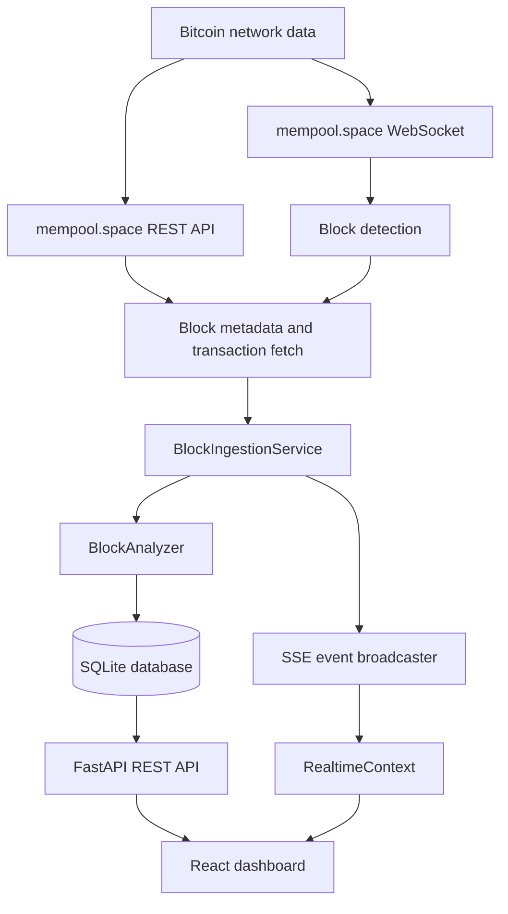
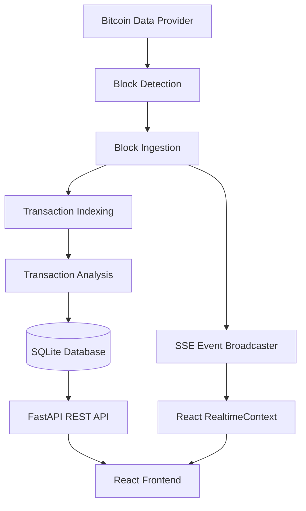

# BIT_ANAMO
## Bitcoin Intelligence & Blockchain Activity Monitoring Platform

BIT_ANAMO is a working Bitcoin blockchain analysis prototype. It collects real block and transaction data from mempool.space, stores a configurable analyzed subset locally, calculates deterministic block and address statistics, and presents those results through a React dashboard and FastAPI API.

It is an intelligence and monitoring foundation, not a full forensic attribution, compliance, or machine-learning system. The sections below describe what is implemented today.

## 1. The Problem

Bitcoin data is public, but it is not automatically easy to interpret. Raw blocks contain transaction IDs, inputs, outputs, fees, scripts, and addresses. An investigator, analyst, developer, or compliance team must combine those records manually to answer basic questions:

- What happened in the latest blocks?
- How much activity was analyzed versus left outside the configured scope?
- Which addresses were most active in an analyzed block?
- Has an address appeared again in a later block?
- How did its observed transaction count and volume change?

The gap is:

```text
Raw blockchain data
        |
        v
Indexed transactions and address activity
        |
        v
Deterministic measurements, monitoring events, and reports
```

BIT_ANAMO narrows that gap by turning recent Bitcoin data into inspectable block, transaction, address, and monitoring views.

## 2. Our Solution

BIT_ANAMO continuously checks the Bitcoin chain, analyzes up to the configured transaction limit per block, persists the results in SQLite, and exposes them through REST endpoints and Server-Sent Events (SSE).

The implemented intelligence includes:

- **Block intelligence:** counts, coverage, volume, fees, input/output counts, transaction extremes, and processing timings.
- **Transaction intelligence:** analyzed transaction amount, fee, input/output counts, and coinbase status.
- **Address intelligence:** locally observed incoming/outgoing activity, transaction history, block history, and net flow.
- **Activity monitoring:** followed addresses are checked against future analyzed blocks.
- **Pattern information:** chronological address activity aggregated by analyzed block.
- **Real-time alerts:** browser notifications for new blocks, completed analysis, and followed-address activity.
- **Reports:** block JSON/CSV/HTML output and address JSON/CSV output.
- **Groq AI summaries:** the backend sends verified block analysis to Groq and returns a grounded JSON summary; missing keys and provider failures produce a safe fallback.

## 3. Key Features

| Feature | What it does | Status | Why it matters |
|---|---|---:|---|
| Real Bitcoin ingestion | Reads block metadata and transactions from mempool.space REST APIs | Fully implemented | The dashboard is backed by real provider data rather than fabricated records |
| Block detection | Uses mempool.space WebSocket notifications with REST tip polling fallback | Fully implemented | New blocks can be processed without manual refresh |
| Configurable transaction scope | Analyzes up to `MAX_TRANSACTIONS_PER_BLOCK` transactions per block | Fully implemented | Keeps the prototype practical while showing total-vs-analyzed coverage |
| Deterministic block analysis | Calculates volume, fees, extremes, averages, UTXO counts, address rankings, and distributions | Fully implemented | Produces reproducible measurements from indexed transactions |
| Transaction table | Provides paginated, searchable, sortable analyzed transactions | Fully implemented | Lets a judge inspect the records behind block metrics |
| Address dossier | Shows activity observed in locally indexed blocks and recent related transactions | Fully implemented, local scope | Makes address-level activity understandable without claiming full chain history |
| Followed-address monitoring | Persists followed addresses and compares later appearances | Fully implemented | Supports recurring observation of selected addresses |
| SSE notifications | Streams `ping`, `new_block_detected`, `block_analyzed`, and `followed_address_hit` | Fully implemented | Keeps the UI current while ingestion runs |
| Temporal patterns | Aggregates address activity by block with cumulative transaction and volume values | Fully implemented, descriptive | Shows observed activity over time; it is not predictive pattern detection |
| Reports | Block and address JSON/CSV/HTML exports | Fully implemented | Exports expose stored analysis and observed address activity |
| Search | Recognizes block heights, known block hashes, known transaction IDs, and address-like strings | Partial | Transaction search identifies results, but navigation to a transaction view is not implemented |
| AI intelligence | Sends verified block analysis to configurable Groq model | Fully implemented when `GROQ_API_KEY` is configured | Produces grounded summaries without exposing provider keys to React |

## 4. How BIT_ANAMO Works



### Processing stages

1. **Data provider:** `MempoolDataProvider` calls mempool.space for block height, block metadata, recent blocks, paginated transactions, addresses, and individual transactions.
2. **Block detection:** `BlockIngestionService._run_loop` subscribes to WebSocket block messages. If the connection times out or closes, it checks the REST tip height after the configured polling interval.
3. **Ingestion:** `ingest_block_by_height` skips an existing block unless reanalysis is requested, fetches metadata and transactions, and runs the analyzer.
4. **Indexing:** the service stores the block, analyzed transactions, inputs, outputs, address activity, and precomputed statistics in SQLite within a database transaction.
5. **Analysis:** `BlockAnalyzer.analyze_block` calculates deterministic metrics and ranks addresses found in transaction inputs and outputs.
6. **API and events:** FastAPI serves stored results. The event broadcaster publishes analysis and monitoring events to connected SSE clients.
7. **Frontend:** `ApiClient` fetches REST data. `RealtimeContext` consumes health data and SSE events, then pages render dashboards, tables, charts, reports, and dossiers.

## 5. Block Intelligence

For each analyzed block, the backend calculates or records:

- Block height, hash, and provider timestamp.
- Total block transaction count from block metadata.
- Number of transactions actually fetched and analyzed.
- Coverage percentage: analyzed transactions divided by total block transactions.
- Total output volume across analyzed transactions.
- Total transaction fees from provider transaction data.
- Largest and smallest analyzed transaction by summed output value.
- Average analyzed transaction output volume.
- Total input and output counts across analyzed transactions.
- Fetch time, analysis time, and total processing time.
- Six output-volume buckets: below `0.01`, `0.01-0.1`, `0.1-1`, `1-10`, `10-100`, and above `100` BTC.
- Ten sequential transaction segments for a descriptive volume/fee timeline when enough transactions exist.

These values are calculated in `backend/app/analyzer/block_analyzer.py`, then persisted in `blocks` and `block_statistics`. They are not hardcoded or randomly generated. The total block count is provider metadata; the other transaction metrics describe the analyzed subset, not the entire block when the configured limit is lower than the block size.

## 6. Transaction Intelligence

For each fetched transaction, BIT_ANAMO stores:

- Transaction ID.
- Block hash, height, and block timestamp.
- Sum of transaction output values in BTC.
- Provider-reported fee in BTC.
- Input and output counts.
- Coinbase classification.

It also stores individual input and output records. Input records include previous transaction/vout references, address when available, and value. Output records include output index, address when available, value, and script type.

The analyzer derives address activity from input addresses (`OUT`) and output addresses (`IN`). It does not currently implement entity clustering, wallet attribution, risk scoring, anomaly detection, mixer detection, or machine-learning classification. The “important activity” views are deterministic rankings by observed transaction count and total activity volume.

## 7. Address Intelligence

Address data is based on addresses observed in the locally analyzed database:

- `GET /api/address/{address}` returns first/last observed blocks, incoming and outgoing BTC, net flow, observed blocks, and recent related transactions.
- `POST /api/address/{address}/follow` creates a persistent watch record and accepts optional notes.
- `DELETE /api/address/{address}/follow` removes the watch record.
- `GET /api/followed` lists watched addresses and accumulated observed totals.
- `GET /api/followed/activity` lists generated follow-up events.
- `GET /api/followed/{address}/compare` compares the latest follow-up observations.
- `GET /api/patterns/{address}` returns chronological per-block activity and cumulative totals.

Following an address does not query the entire Bitcoin chain. It monitors future blocks that BIT_ANAMO analyzes and initializes totals from activity already present in the local database.

## 8. Real-Time Monitoring

```text
New Bitcoin block
        |
        v
WebSocket detection or REST tip polling
        |
        v
Block ingestion and deterministic analysis
        |
        v
SQLite transaction commit
        |
        v
SSE event broadcaster
        |
        v
RealtimeContext
        |
        v
Dashboard state, tables, and notifications
```

Implemented SSE event types:

- `ping`: initial connection confirmation and client keepalive state.
- `new_block_detected`: a block was detected and is being ingested.
- `block_analyzed`: the complete analyzed block summary is available.
- `followed_address_hit`: a followed address appeared in the analyzed block.
- Comment-only keepalive frames are emitted when no event arrives for 15 seconds.

The frontend closes the EventSource on errors and retries after five seconds. API responses for blocks, transactions, addresses, followed records, patterns, AI, and health are runtime-normalized before entering React state, so malformed payloads do not recreate the earlier blank-screen failure.

## 9. Dashboard

The dashboard displays values sourced from the API and SQLite-backed analysis:

- Latest analyzed block and timestamp.
- Total versus analyzed transaction count and coverage.
- Total volume, fees, average transaction, largest transaction, and input/output counts.
- Fetch, analysis, and total processing latency.
- Recent analyzed blocks table.
- Volume, transaction, fee, and input/output charts.
- Most active address rankings for the selected recent block.
- Links into block analysis and address dossiers.
- Live block and follow-up notification toasts.

Charts use block statistics returned by the backend. They are not populated with random or synthetic values. Explorer and Reports defaults are derived from the live latest block where available; a manually entered stored block can still become unavailable if it is outside the local database.

## 10. Reports

Available endpoints:

| Report | JSON | CSV | HTML |
|---|---:|---:|---:|
| Block report | Working | Working | Working |
| Address dossier | Working | Working | **Not currently working as HTML** |

Block reports include block metadata, precomputed statistics, and up to 500 analyzed transaction records. Address reports include the followed record, follow-up events, and up to 200 recent address activity records.

The address report service currently returns JSON for all formats, including `format=html`; the endpoint responds successfully but does not generate HTML. The UI therefore should not be presented as having a working printable address report until that implementation is corrected.

## 11. AI Intelligence

**Status: Implemented when configured; graceful fallback when unavailable.**

`AIService` sends structured verified analysis to the Groq OpenAI-compatible chat completions endpoint. Block analysis is exposed through `/api/ai/block/{height_or_hash}` and is used by the Block Analysis AI tab.

The model, endpoint, timeout, and retry count are configurable through backend environment variables. The prompt requires JSON output and forbids inventing counts, amounts, addresses, risks, or patterns. Missing keys, invalid responses, timeouts, and provider errors return a useful unavailable response containing the verified structured payload. API keys remain backend-only.

## 12. Technology Stack

| Area | Technology used |
|---|---|
| Frontend | React 19, TypeScript, Vite |
| Styling | Tailwind CSS and project CSS |
| Backend | Python, FastAPI, Uvicorn |
| Database | SQLite 3 with WAL mode |
| Blockchain provider | mempool.space REST API and WebSocket |
| Real-time transport | Server-Sent Events from FastAPI; WebSocket/polling for backend detection |
| Charts | Recharts |
| Icons | Lucide React |
| HTTP client | httpx and browser Fetch API |
| Configuration | pydantic-settings and `.env` |
| Build and checks | npm, TypeScript compiler, Vite, oxlint, pytest |
| AI provider | Groq API, configurable model, backend-only API key |

## 13. System Architecture



### Important backend modules

- `backend/app/providers/mempool_provider.py`: provider REST calls and transaction pagination.
- `backend/app/services/ingestion_service.py`: startup seeding, WebSocket detection, polling fallback, ingestion, persistence, and event publication.
- `backend/app/analyzer/block_analyzer.py`: deterministic block, transaction, address, distribution, and follow-up calculations.
- `backend/app/database.py`: SQLite connection, schema creation, query helpers, and indexes.
- `backend/app/services/event_service.py`: in-memory subscriber queues for SSE.
- `backend/app/services/follow_service.py`: followed address records, events, and comparisons.
- `backend/app/services/report_service.py`: block and address exports.
- `backend/app/services/ai_service.py`: grounded Groq integration with timeout, retry, parsing, and fallback handling.

### Database tables

- `blocks`: one analyzed summary per block height/hash.
- `transactions`: analyzed transaction summaries.
- `transaction_inputs` and `transaction_outputs`: indexed UTXO-side records.
- `address_activity`: address direction and value observations.
- `block_statistics`: JSON snapshots used by analysis views.
- `followed_addresses`: persistent monitoring targets and accumulated observations.
- `follow_up_events`: appearances of followed addresses in later analyzed blocks.

## 14. API Overview

| Method | Endpoint | Purpose |
|---|---|---|
| GET | `/api/health` | Runtime configuration, database counts, and latest block |
| GET | `/api/blocks` | Paginated block summaries |
| GET | `/api/blocks/latest` | Latest stored block |
| GET | `/api/blocks/{height_or_hash}` | Stored block or on-demand height ingestion |
| GET | `/api/blocks/{height_or_hash}/analysis` | Block statistics and ranked addresses |
| GET | `/api/blocks/{height_or_hash}/transactions` | Paginated analyzed transactions |
| GET | `/api/blocks/{height_or_hash}/addresses` | Ranked addresses for a block |
| POST | `/api/blocks/{height_or_hash}/reanalyze` | Re-fetch and reanalyze a block |
| GET/POST/DELETE | `/api/address/{address}` and `/follow` | Address dossier and following controls |
| GET | `/api/followed` and `/activity` | Watchlist and generated events |
| GET | `/api/followed/{address}/compare` | Follow-up observation comparison |
| GET | `/api/patterns/{address}` | Per-block address activity pattern |
| GET | `/api/search?q=...` | Block, transaction, or address classification |
| GET | `/api/reports/*` | JSON, CSV, and report responses described above |
| GET | `/api/ai/*` | Grounded Groq summary responses or safe unavailable fallback |
| GET | `/api/events` | SSE stream |

## 15. How to Run

### Prerequisites

- Python 3.10 or newer
- Node.js and npm
- Network access to mempool.space for live ingestion

### Backend

```powershell
cd backend
python -m pip install -r requirements.txt
python -m uvicorn app.main:app --host 127.0.0.1 --port 8000
```

The backend initializes `backend/bitcoin_intel.db`, seeds recent blocks, then starts WebSocket detection with REST polling fallback.

### Frontend

```powershell
cd frontend
npm install
npm run dev
```

The Vite configuration uses `http://localhost:5174` by default and proxies `/api` to `http://127.0.0.1:8000`.

### One-click startup

From the project root, double-click `start.bat`. It checks Python and npm, detects a root or backend virtual environment when present, installs frontend dependencies if needed, starts FastAPI on port `8000`, starts Vite on port `5174`, opens the browser, and prints the application URLs.

### Checks

```powershell
cd frontend
npm run build
npm run lint

cd ..
python -m pytest -q
```

The default test suite runs focused behavior tests. The legacy live integration checks are opt-in with `RUN_INTEGRATION=1` and require the backend plus frontend servers to be running.

## 16. Judge Demonstration

1. Start the backend and frontend.
2. Open the Dashboard and identify the latest block, coverage, volume, fees, and processing timings.
3. Open **Live Blocks** and inspect real block hashes, transaction counts, coverage, and analysis timing.
4. Open a block analysis view and inspect the Overview, Transactions, Addresses, Amounts, IN/OUT, and Timeline tabs.
5. Open a ranked address, inspect observed IN/OUT flow and related transactions, then follow it.
6. Open **Follow-Up**, review the watchlist and any generated follow-up events, and use Compare when multiple observations exist.
7. Use Explorer to search a stored block height, stored block hash, analyzed transaction ID, or observed address.
8. Generate a block JSON, CSV, or HTML report. Generate an address JSON or CSV report.
9. Open the AI tab and click **Generate Groq Summary** to summarize the verified block analysis. Without `GROQ_API_KEY`, the UI shows the safe unavailable state and preserves the structured payload.
10. Watch the Dashboard for `new_block_detected`, `block_analyzed`, and followed-address notifications while the backend remains online.

## 17. Verified Limitations and Next Improvements

The audit found the following items that should be addressed before calling the project production-ready:

- Configure `GROQ_API_KEY` for live AI summaries; the application remains functional without it.
- Validate Bitcoin address formats and return `404` or `400` for unknown/invalid addresses instead of empty `200` dossiers.
- Add a dedicated transaction detail page; transaction search currently routes to the containing block when a block height is available.
- Make filter controls apply their advertised time window and address-activity filters.
- Add tests for malformed payloads, provider failures, SSE reconnects, empty blocks, and database failures.
- Tighten CORS, add authentication/rate limiting for write and reanalysis endpoints, and escape values in generated HTML reports.
- Provider transaction page failures now fail ingestion rather than silently producing incomplete analysis; retry and recovery policy can still be improved for long outages.

These limitations are intentional disclosures for evaluation. The implemented ingestion, storage, deterministic analysis, address monitoring, API, SSE, and dashboard paths are the working core of BIT_ANAMO.


## Developers
 - S Mahendiran 
 - R Gowtham
 - Ashwini 
 - Bagavathi
 - Yokesh
 - Roobeshwaran
